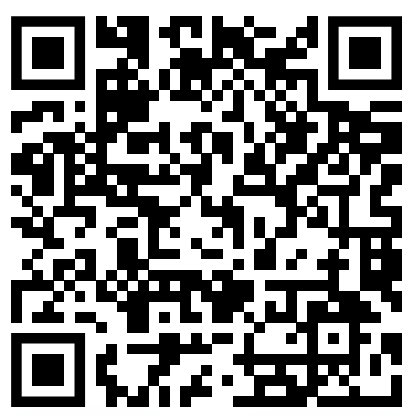

# Mi sitio personal
Este es mi sitio personal. Aquí puedes encontrar información sobre mí, mis
proyectos y mis intereses.
Mi trayectoria es la siguiente:
Bachiller de la república en humanidades modernas con especialización en física-matemática graduado en la Unidad Educativa Particular De La Asunción, estudiante de la Escuela Superior Politécnica del Litoral (ESPOL) en Guayaquil en la carrera  de Ingeniería en Computación, Autodidacta en temas relacionados a la robótica desde los 8 años y programación desde los 10, comparte su experiencia en su canal de YouTube llamado ProgramadorVisionario  desde los 15 años en el que ha tenido la oportunidad de crear algunos proyectos en colaboración con su colegio como por ejemplo el concurso de robótica en la Escuela Politécnica del Litoral RETO DEL PACIFICO 2017 y en el NASA SPACE APPS CHALLENGE GUAYAQUIL 2018, a sus 20 años participó en el NASA SPACE APPS CHALLENGE GUAYAQUIL 2020 donde ganó la categoría CONECTAR representando al Guayaquil Space Society del cual es parte en donde se apoya la participación del Ecuador en investigaciones científicas y empresariales en el ámbito aeroespacial. Desde 2023 es parte del Google Developers Group Guayaquil como miembro activo participando en actividades relacionadas al ámbito tecnológico y académico.
En 2024 impartió el curso de  INGENIERÍA Y ROBÓTICA CON ARDUINO Y PYTHON representando a la Federación de estudiantes de la ESPOL (FEPOL) y al Guayaquil Space Society con el objetivo de unificar los conocimientos impartidos en los primeros semestres de universidad en una aplicación práctica que servirá de base para la formación de futuros ingenieros.

## Contenido
* [Información personal](#información-personal)
* [Proyectos](#proyectos)
* [Intereses](#intereses)
## Información personal
* Nombre: Marcos Alejandro Moreira Merino
* Ocupación: Estudiante de la carrera de Ingeniería en Computación en la ESPOL

## Proyectos
* ProyectoBasesDatosCrowfounding : (https://github.com/mamomeri/ProyectoBasesDatosCrowfounding)
## Intereses
* Programar.
* Practicar idiomas.
* Editar videos.

El código QR de esta página es: 
